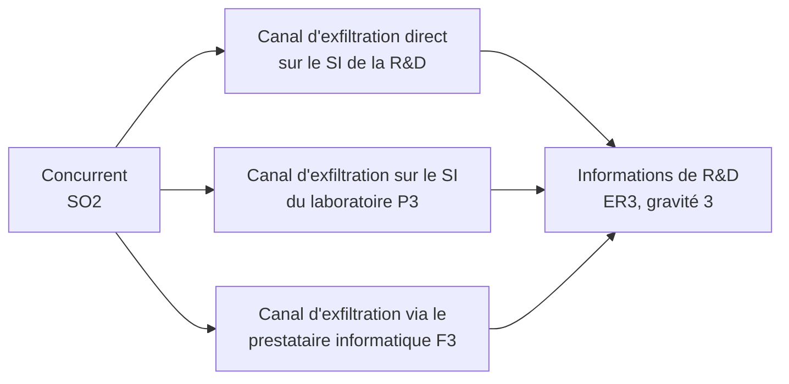
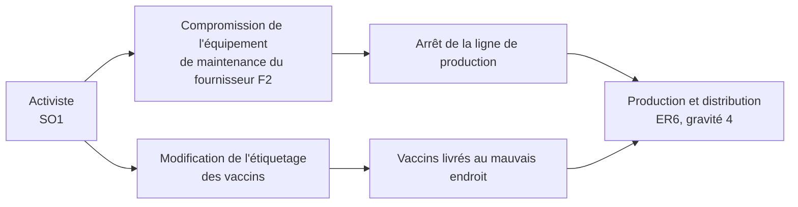
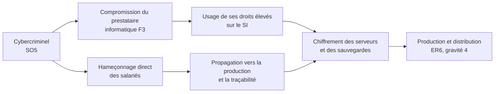

# EBIOS RM, atelier 3 : scénarios stratégiques

*Étiquettes : `[ANSSI p. N]` repris du guide, `[Original]` travail de ce projet, `[Hypothèse]` choix à discuter.
Voir [`CREDITS.md`](../CREDITS.md).*

## 1. Écosystème et parties prenantes

Le guide retient d'abord les parties prenantes **externes** `[ANSSI p. 46]`.

| Catégorie | Réf. | Partie prenante |
|---|---|---|
| Clients | C1, C2, C3 | Établissements de santé ; pharmacies ; dépositaires et grossistes répartiteurs |
| Partenaires | P1, P2, P3 | Universités ; régulateurs ; laboratoires |
| Prestataires | F1, F2, F3 | Fournisseurs industriels chimistes ; fournisseurs de matériel de production ; prestataire informatique |

## 2. Cartographie de dangerosité

La dangerosité mesure la capacité d'une source de risque à exploiter la relation avec une partie prenante pour atteindre son
objectif. Elle ne préjuge d'aucune intention malveillante de cette partie `[ANSSI p. 44]`. Formule utilisée : **(dépendance x
pénétration) / (maturité cyber x confiance)**, composantes de 1 à 4. Seuils du guide : veille 0,2 ; contrôle 0,9 ; danger 2,5
`[ANSSI p. 47]`.

Le tableau complet est dans [`tableaux/parties-prenantes.md`](tableaux/parties-prenantes.md). Le guide ne donne pas les composantes
de chaque partie prenante, seulement le résultat pour trois d'entre elles `[ANSSI p. 54]`. Les composantes de F2, F3 et P3 sont donc
**reconstituées** pour retrouver exactement ces résultats (le script de vérification échoue si ce n'est plus le cas). Les six autres
cotations sont des hypothèses `[Hypothèse]`.

| Partie prenante | Dangerosité | Zone | Retenue comme critique |
|---|---|---|---|
| F3 Prestataire informatique | 3,00 | Danger | Oui `[ANSSI p. 47]` |
| P3 Laboratoires | 2,25 | Contrôle | Oui `[ANSSI p. 47]` |
| F2 Fournisseurs de matériel | 2,00 | Contrôle | Oui `[ANSSI p. 47]` |
| P1 Universités | 1,00 | Contrôle | Non, décision du responsable projet `[ANSSI p. 47]` |
| F1 Fournisseurs chimistes | 1,00 | Contrôle | Non, décision du responsable projet `[ANSSI p. 47]` |
| Autres (C1, C2, C3, P2) | 0,17 à 0,44 | Veille ou hors seuil | Non |

Le guide précise que l'analyse est une aide à la décision et que la gouvernance du projet peut écarter un élément pour des
raisons de contexte `[ANSSI p. 47, note 23]`. P1 et F1 sont en zone de contrôle : ils sont à réexaminer au prochain cycle
`[Original]`.

## 3. Scénarios stratégiques

Un scénario stratégique décrit, à haut niveau, comment une source de risque atteint son objectif en passant par l'écosystème ou
en détournant un processus. Sa gravité est celle de l'ER associé `[ANSSI p. 49]`.

### SS1 : un concurrent vole des travaux de recherche (gravité 3) `[ANSSI p. 50]`

Trois chemins d'attaque : ils deviennent les risques **R1**, **R2** et **R3**.

### SS2 : un activiste perturbe la production ou la distribution (gravité 4) `[ANSSI p. 51]`

Deux chemins : **R4** et **R5**. La gravité est celle du cas le plus défavorable, un incident de plus d'une semaine pendant un pic
d'épidémie `[ANSSI p. 51]`.

### SS3 : un cybercriminel paralyse la production par un rançongiciel (gravité 4) `[Original]`

Deux chemins : **R6** (par le prestataire) et **R7** (par hameçonnage direct). Le premier réutilise le maillon faible déjà
identifié, F3 : un attaquant bien renseigné choisit la partie prenante qui donne le moins d'effort `[ANSSI p. 44]`.

## 4. Mesures de sécurité sur l'écosystème

Le guide définit des mesures pour les trois parties prenantes critiques et estime la dangerosité résiduelle : neuf à douze
mois de travail sont nécessaires `[ANSSI p. 54]`. Il prévient qu'une mesure ne réduit la dangerosité que si elle est
effectivement mise en œuvre avant la suite de l'analyse (`[ANSSI p. 53, note 26]`) : les valeurs « après » ci-dessous sont des
**cibles**, pas l'état actuel.

| Partie | Mesure du guide `[ANSSI p. 54]` | Effet | Dangerosité | Mesure du plan |
|---|---|---|---|---|
| F2 Fournisseurs de matériel | Matériels de maintenance administrés par la DSI et mis à disposition sur site | Pénétration de 3 à 2 | 2 puis 1,3 | M13 |
| F3 Prestataire informatique | Audit de sécurité inclus au contrat, suivi du plan d'action ; protection renforcée des données de R&D | Maturité cyber de 2 à 3 | 3 puis 2 | M03, M05, M07 |
| P3 Laboratoires | Limiter les données transmises au juste besoin (« tout » est diffusé aujourd'hui) | Pénétration de 3 à 2 | 2,25 puis 1,5 | M06 |

### Ajouts de ce projet `[Original]`

- **F3 passe de 3,00 (zone de danger) à 2,00 (zone de contrôle) après ces mesures, mais garde la dangerosité la plus élevée de
  l'écosystème.** Les mesures **N04** (authentification forte) et **N05** (accès du prestataire encadrés) agissent
  sur les scénarios R3 et R6 directement, sans attendre que la maturité du prestataire progresse : elles limitent ce que le
  prestataire peut faire même s'il est compromis.
- La partie prenante F3 apparaît dans deux scénarios stratégiques sur trois (SS1 et SS3) : c'est le point de concentration du
  risque de l'écosystème.
- Une piste pour F3 vient du guide lui-même, en atelier 5 : entrer au capital du prestataire ou en changer `[ANSSI p. 81]`. Voir
  l'[atelier 5](06-ebios-atelier5-traitement-du-risque.md).

## 5. Synthèse

| Scénario | Source | Chemins | Gravité | Risques |
|---|---|---|---|---|
| SS1 | Concurrent | 3 | 3 | R1, R2, R3 |
| SS2 | Activiste | 2 | 4 | R4, R5 |
| SS3 | Cybercriminel | 2 | 4 | R6, R7 |
