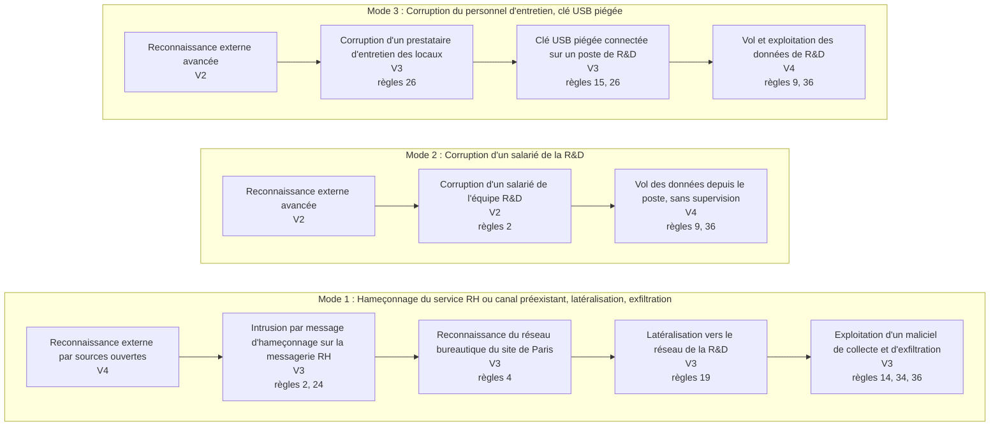
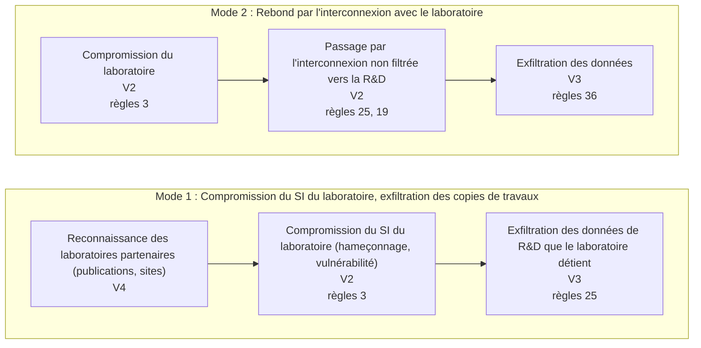
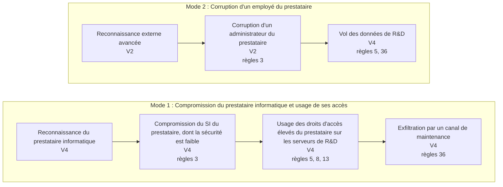
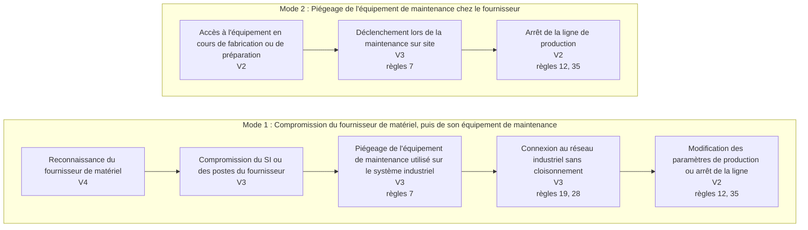
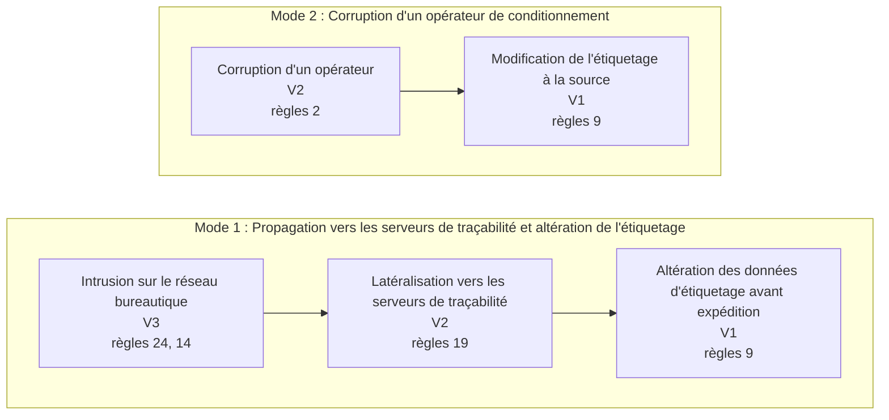
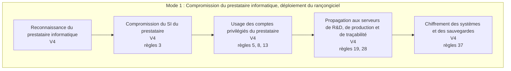
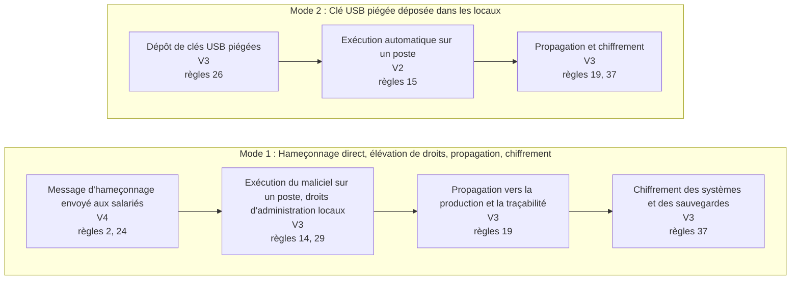

# Scénarios opérationnels : graphes d'attaque

*Fichier généré par `python tools/build.py` à partir de `data/`. Ne pas modifier à la main.*

Un graphe par risque. Chaque bloc est un mode opératoire, lu de gauche à droite : de la reconnaissance jusqu'à l'exploitation. V1 à V4 est la vraisemblance élémentaire de l'action ; « règles » renvoie aux règles du Guide d'hygiène dont l'écart la facilite (voir [le socle](socle.md)). La vraisemblance du scénario est celle du mode de moindre effort, calculée dans [vraisemblances.md](vraisemblances.md).

## R1 : Un concurrent vole des informations de R&D grâce à un canal d'exfiltration direct

Gravité G3, vraisemblance V3 (ANSSI-EBIOS p. 72, p. 67).

## R2 : Un concurrent vole des informations de R&D en exfiltrant celles détenues par le laboratoire

Gravité G3, vraisemblance V2 (ANSSI-EBIOS p. 72, p. 67).

## R3 : Un concurrent vole des informations de R&D grâce à un canal d'exfiltration via le prestataire informatique

Gravité G3, vraisemblance V4 (ANSSI-EBIOS p. 72, p. 67).

## R4 : Un activiste provoque un arrêt de la production des vaccins en compromettant l'équipement de maintenance du fournisseur de matériel

Gravité G4, vraisemblance V2 (ANSSI-EBIOS p. 72, p. 67).

## R5 : Un activiste perturbe la distribution de vaccins en modifiant leur étiquetage

Gravité G4, vraisemblance V1 (ANSSI-EBIOS p. 72, p. 67).

## R6 : Un cybercriminel paralyse la production par un rançongiciel déployé à partir du prestataire informatique

Gravité G4, vraisemblance V4 (Original).

## R7 : Un cybercriminel paralyse la production par un rançongiciel après hameçonnage direct des salariés

Gravité G4, vraisemblance V3 (Original).

